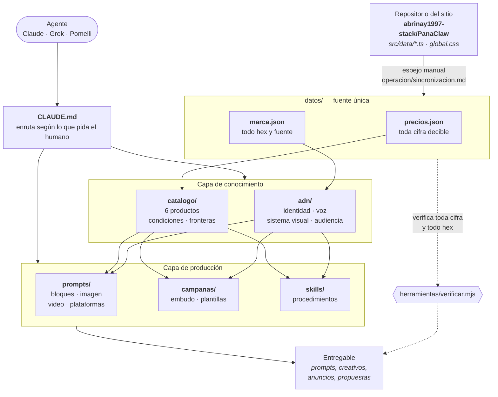
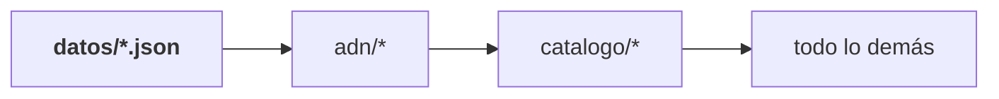

# PanaClaw Workspace

El cerebro de la marca **PanaClaw**, agencia de sitios web en Panamá.

Es sobre todo una base de conocimiento, pensada para que **cualquier agente de
IA** —Claude, Grok, Gemini, Pomelli, Canva— entre, entienda la marca en una sola
lectura y devuelva un entregable que suene, se vea y cobre exactamente como
PanaClaw.

Y desde agosto de 2026 es también **el hub de herramientas del equipo**: una
portada con acceso a la página web, al cotizador y al CRM, publicada en Netlify.
El cotizador vive aquí y no en el repositorio del sitio por una razón concreta
—lee `datos/precios.json` directamente, así que no puede cotizar un precio que
la marca no publique—. Está explicado abajo.

> **Si eres un agente, empieza por [`CLAUDE.md`](CLAUDE.md).** Trae las reglas
> duras y la tabla que te manda al resto según lo que te hayan pedido.

---

## Para qué sirve

Le pides a una IA «prompts de Nano Banana para la campaña de eBot», «cuatro
anuncios para Meta» o «una propuesta para este cliente», y sale con los precios
correctos, los hex correctos, la voz correcta y —lo más difícil— **diciendo qué
no incluye**, que es la firma de la marca.

---

## Cómo está todo conectado

De dónde sale la verdad, por dónde pasa y en qué se convierte:



**Lo que hace que esto no se pudra:** las cifras y los hex viven en **un solo
sitio**. Todo lo demás apunta a `datos/`, no lo copia. Es la misma regla que el
sitio aplica a su código, y `verificar.mjs` la hace cumplir sola.

### Jerarquía de autoridad

Cuando dos archivos se contradigan, gana el de la izquierda:



Un `.md` que diga `$300` cuando `precios.json` dice `$295` está equivocado, y se <!-- v: contraejemplo, $300 es la cifra equivocada que se ilustra -->
corrige el `.md`. Nunca al revés.

### Qué lee un agente según lo que le pidas


La tabla completa está en [`CLAUDE.md`](CLAUDE.md) y, con más detalle, en
[`orquestador/enrutador.md`](orquestador/enrutador.md).

---

## El árbol

```
CLAUDE.md         ← El orquestador. Punto de entrada de cualquier agente.

datos/            Las dos fuentes de verdad. Máquina antes que prosa.
  precios.json      Toda cifra que la marca puede decir en voz alta
  marca.json        Todo token visual: hex, fuentes, formas, movimiento

adn/              Quién es la marca. Se lee antes de escribir una palabra.
  01-identidad · 02-voz-y-tono · 03-sistema-visual · 04-audiencia

catalogo/         Qué vende, en prosa. Capa legible sobre precios.json.
  Los seis productos + condiciones, fronteras y prueba

prompts/          ESTRUCTURAS de prompt. No guiones.
  bloques/          Fragmentos que se copian literales en cada pieza
  imagen/ video/ texto/
  plataformas/      Pomelli, Grok, Canva

campanas/         Embudo, plantillas de pieza y notas por canal
skills/           Procedimientos empaquetados para agentes
orquestador/      Reglas duras, enrutador y protocolo de entrega
herramientas/     verificar.mjs
operacion/        Sincronización con el sitio y deuda conocida

── lo único que se publica ──────────────────────────────────────

index.html        La portada del hub. Sin construir, sin dependencias.
hub/assets/       Su icono y la tipografía de la marca
cotizador/        La herramienta. Lee datos/precios.json de aquí arriba.
scripts/          construir.mjs — arma publico/
netlify.toml      Cómo lo publica Netlify
```

---

## El hub de herramientas

Lo único de este repositorio que sale a la web. Todo lo demás —`datos/`, `adn/`,
`catalogo/`, `prompts/`— se queda dentro.

```
/                 la portada, con las tres tarjetas
/cotizador/       el cotizador y su historial
```

| Herramienta | Dónde vive |
| --- | --- |
| **Portada** | Aquí: `index.html` |
| **Cotizador** | Aquí: [`cotizador/`](cotizador/) |
| **Página web** | Fuera: `abrinay1997-stack/PanaClaw` → panaclaw.com |
| **CRM · eBot** | Fuera: su propio servidor |

### Por qué el cotizador está aquí

Porque **importa `datos/precios.json` de la raíz**, sin copia y sin archivo
generado. La regla 1 de la marca —ninguna cifra que no esté en `precios.json`—
deja de depender de que alguien se acuerde: un precio que cambia allí cambia en
la pantalla, en el PDF y en el mensaje de WhatsApp a la vez.

Lo demás que hace, y las dos reglas de marca que lleva escritas en el sistema de
tipos, está en [`cotizador/README.md`](cotizador/README.md).

### Ponerlo en marcha

```bash
npm run instalar    # dependencias del cotizador
npm test            # las reglas de precio, el PDF y el mensaje
npm run pantalla    # la pantalla con recarga en caliente, en :5173
npm run build       # verifica, prueba y deja el sitio en publico/
```

La portada **no se construye**: es un `index.html` con los estilos dentro y sin
dependencias. Abrirla con doble clic y verla igual que publicada vale más que
meterla en un empaquetador para no ganar nada.

### Publicar

Netlify, con [`netlify.toml`](netlify.toml) ya escrito. Al conectar el
repositorio, la única decisión que queda por tomar a mano es la puerta: el hub
es interno, así que hay que encender la protección por contraseña de Netlify
(Site configuration → Access control → Password protection). Sin eso, el
historial de propuestas —con nombres y teléfonos de clientes— queda a la vista
de quien dé con la dirección.

El sitio se sirve en su propio subdominio de `panaclaw.com`, no en la raíz: ahí
vive la página pública. La portada lleva `noindex` en el HTML y en las cabeceras
del servidor.

---

## Comprobar que está al día

```bash
node herramientas/verificar.mjs
```

Sin dependencias. Vigila que ninguna cifra se haya salido de `precios.json`,
ningún hex de `marca.json` —también en el código del hub—, que no se cuele jerga
y que no haya enlaces rotos. Detalles en
[`herramientas/README.md`](herramientas/README.md).

---

## Relación con el repositorio del sitio

El sitio vive en **`abrinay1997-stack/PanaClaw`** (Astro estático en Netlify) y es
la fuente original de casi todo lo que hay aquí: los precios salen de
`src/data/*.ts` y los tokens de `src/styles/global.css`.

**Esto es un espejo, no una copia paralela.** El mapeo archivo a archivo y el
procedimiento están en
[`operacion/sincronizacion.md`](operacion/sincronizacion.md).

---

## Antes de arrancar una campaña

Lee [`operacion/deuda-conocida.md`](operacion/deuda-conocida.md). Queda una cosa
abierta que afecta directamente a cualquier trabajo de marketing:

1. **Google Analytics sin configurar** — hoy solo mide Meta, así que una campaña
   de Google se puede correr pero no leer

Cerrado el 2026-08-17: el sitio ya tiene dominio propio, `panaclaw.com`. Es el
único destino que se pone en una pieza; `panaclaw.netlify.app` no se reparte.

Cerrado el 2026-08-14: la imagen social del sitio llevaba un nombre de marca
anterior y una palabra de jerga. Es lo que se ve al compartir un enlace y lo que
leen las herramientas que deducen la marca rastreando el sitio, así que
bloqueaba el flujo de Pomelli. Ya dice `PANACLAW.`

---

## Qué NO es este repositorio

- **No es un almacén de guiones escritos.** No hay copys finales guardados. Hay
  estructuras: el copy se genera cada vez, contra el ADN, para el contexto
  concreto.
- **No es un histórico.** Lo que deja de ser cierto se borra. El historial de git
  ya guarda lo viejo.
- **No es documentación del código del sitio.** Eso está en el otro repositorio.
- **No es el sitio.** El hub que se publica desde aquí es interno y para el
  equipo. Lo que ve un cliente vive en `abrinay1997-stack/PanaClaw`, y desde
  aquí no se edita.
