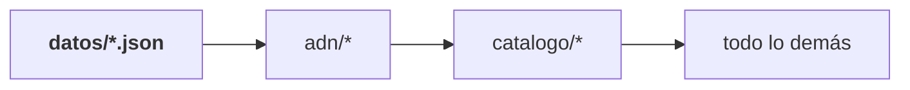
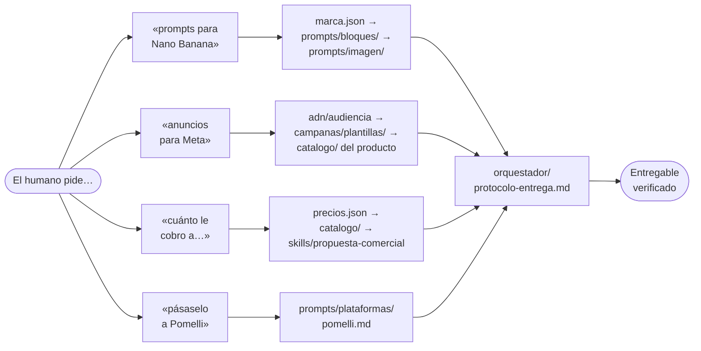

# PanaClaw Workspace

El cerebro de la marca **PanaClaw**, agencia de sitios web en Panamá.

Es sobre todo una base de conocimiento, pensada para que **cualquier agente de
IA** —Claude, Grok, Gemini, Pomelli, Canva— entre, entienda la marca en una sola
lectura y devuelva un entregable que suene, se vea y cobre exactamente como
PanaClaw.

Y desde agosto de 2026 es también **el hub de herramientas del equipo**: una
portada con acceso a la página web, al cotizador, a la libreta de clientes y al
CRM, publicada en Cloudflare detrás de una sola puerta. El cotizador vive aquí y
no en el repositorio del sitio por una razón concreta —lee `datos/precios.json`
directamente, así que no puede cotizar un precio que la marca no publique—. Está
explicado abajo.

> **Si eres un agente, empieza por [`CLAUDE.md`](CLAUDE.md).** Trae las reglas
> duras y la tabla que te manda al resto según lo que te hayan pedido.

---

## Para qué sirve

Le pides a una IA «prompts de Nano Banana para la campaña de eBot», «cuatro
anuncios para Meta» o «una propuesta para este cliente», y sale con los precios
correctos, los hex correctos, la voz correcta y —lo más difícil— **diciendo qué
no incluye**, que es la firma de la marca.

---

## Cómo está todo conectado

De dónde sale la verdad, por dónde pasa y en qué se convierte:


**Lo que hace que esto no se pudra:** las cifras y los hex viven en **un solo
sitio**. Todo lo demás apunta a `datos/`, no lo copia. Es la misma regla que el
sitio aplica a su código, y `verificar.mjs` la hace cumplir sola.

### Jerarquía de autoridad

Cuando dos archivos se contradigan, gana el de la izquierda:



Un `.md` que diga `$300` cuando `precios.json` dice `$295` está equivocado, y se <!-- v: contraejemplo, $300 es la cifra equivocada que se ilustra -->
corrige el `.md`. Nunca al revés.

### Qué lee un agente según lo que le pidas



La tabla completa está en [`CLAUDE.md`](CLAUDE.md) y, con más detalle, en
[`orquestador/enrutador.md`](orquestador/enrutador.md).

---

## El árbol

```
CLAUDE.md         ← El orquestador. Punto de entrada de cualquier agente.

datos/            Las dos fuentes de verdad. Máquina antes que prosa.
  precios.json      Toda cifra que la marca puede decir en voz alta
  marca.json        Todo token visual: hex, fuentes, formas, movimiento

adn/              Quién es la marca. Se lee antes de escribir una palabra.
  01-identidad · 02-voz-y-tono · 03-sistema-visual · 04-audiencia

catalogo/         Qué vende, en prosa. Capa legible sobre precios.json.
  Los seis productos + condiciones, fronteras y prueba

prompts/          ESTRUCTURAS de prompt. No guiones.
  bloques/          Fragmentos que se copian literales en cada pieza
  imagen/ video/ texto/
  plataformas/      Pomelli, Grok, Canva

campanas/         Embudo, plantillas de pieza y notas por canal
skills/           Procedimientos empaquetados para agentes
orquestador/      Reglas duras, enrutador y protocolo de entrega
herramientas/     verificar.mjs
operacion/        Sincronización con el sitio y deuda conocida

── lo único que se publica ──────────────────────────────────────

index.html        La portada del hub. Sin construir, sin dependencias.
hub/assets/       Su icono y la tipografía de la marca
cotizador/        El cotizador y el panel de clientes. Leen datos/precios.json.
compartido/       El contrato entre la pantalla y el servidor: qué viaja
worker/           La API: historial, clientes y la puerta de Access
migraciones/      El esquema de la base, en SQL
scripts/          construir.mjs — arma publico/
wrangler.jsonc    Cómo lo publica Cloudflare
netlify.toml      Cómo se publica la vista previa
```

---

## El hub de herramientas

Lo único de este repositorio que sale a la web. Todo lo demás —`datos/`, `adn/`,
`catalogo/`, `prompts/`— se queda dentro.

```
/                      la portada, con las cuatro tarjetas
/cotizador/            el cotizador
/cotizador/#historial  lo emitido, con su estado y su papelera
/cotizador/#clientes   la libreta, con la ficha de cada cliente
/api/                  el historial y los clientes por dentro
```

| Herramienta | Dónde vive |
| --- | --- |
| **Portada** | Aquí: `index.html` |
| **Cotizador** | Aquí: [`cotizador/`](cotizador/) |
| **Historial** | Aquí: [`worker/`](worker/) + la base de Cloudflare |
| **Clientes** | Aquí: `cotizador/src/clientes/` + [`worker/clientes.ts`](worker/clientes.ts) |
| **Página web** | Fuera: `abrinay1997-stack/PanaClaw` → panaclaw.com |
| **CRM · eBot** | Fuera: `abrinay1997-stack/CRM-PANACLAW`, su propio Worker |

### Por qué el cotizador está aquí

Porque **importa `datos/precios.json` de la raíz**, sin copia y sin archivo
generado. La regla 1 de la marca —ninguna cifra que no esté en `precios.json`—
deja de depender de que alguien se acuerde: un precio que cambia allí cambia en
la pantalla, en el PDF y en el mensaje de WhatsApp a la vez.

Es también la razón por la que el panel de clientes se hizo aquí dentro y no en
un repositorio nuevo: un repositorio aparte necesitaría **una copia** de
`precios.json`, y una copia es exactamente lo que esa regla prohíbe.

### Por qué en Cloudflare y no en Netlify

Por dos cosas que Netlify no puede dar y que el panel necesita:

1. **Una base que todos vean.** El historial vivía en el navegador de cada
   quien: con una persona cotizando funcionaba, y con dos, dos clientes
   distintos podían recibir la misma «PROP-2026-0007» sin que nadie se enterara
   hasta cruzar los dos PDF. Ahora el número lo da la base, en una sola
   sentencia que dos personas emitiendo a la vez no pueden desordenar.
2. **Una sola puerta.** Cloudflare Access pone delante del sitio entero una
   pantalla de correo con la lista del equipo: la portada, el cotizador, los
   clientes y lo que se añada mañana. Y el servidor **comprueba la firma** de
   ese token en cada petición, así que quién emitió una propuesta no es un campo
   que rellene quien llama.

Netlify se queda con la **vista previa** ([`netlify.toml`](netlify.toml)), que
se construye sin servidor: ahí el historial vuelve al navegador —con números
`PROP-DEMO-0001`, para que ningún PDF de ésos se confunda con uno de verdad— y
el panel de clientes dice que le falta el servidor en vez de enseñar una libreta
de mentira. Cuando Cloudflare esté en pie, se apaga: dos copias del hub en pie
es como alguien acaba cotizando en la que no era.

### La libreta de clientes

Hasta ahora los datos de un cliente vivían dentro de cada propuesta, y solo ahí.
Ahora el cliente existe por su cuenta: quién es, cómo se le escribe, en qué punto
está la relación, y qué se le ha propuesto.

Tres cosas que conviene saber antes de tocarla:

- **La ficha manda, la propuesta toma prestado.** Emitir puede CREAR una ficha
  que no existía —no hay nada que perder al llenar un hueco— pero nunca cambia
  una que ya está escrita. Corregir un teléfono es un acto deliberado y se hace
  en el panel.
- **Se reconoce por el WhatsApp y por el correo, no por el nombre.** Dos
  propuestas al mismo número son del mismo cliente aunque el nombre esté escrito
  de dos formas. Dos negocios que se llaman igual **no** se unen solos: la
  propuesta queda sin enlazar, se dice en pantalla y alguien lo decide.
- **Borrar un cliente no borra sus propuestas.** Y se borra en dos tiempos:
  papelera primero —reversible, con constancia de quién retiró— y borrado de
  verdad después, desde dentro de la papelera.

Lo demás está en [`cotizador/README.md`](cotizador/README.md).

### Ponerlo en marcha

```bash
npm run instalar    # dependencias del hub y del cotizador
npm test            # las reglas de precio, el PDF, el mensaje y el contrato
npm run tipos       # comprueba los tipos del Worker y de la pantalla
npm run build       # verifica, prueba y deja el sitio en publico/
```

Para trabajar, dos terminales:

```bash
npm run dev         # el Worker, el historial y los clientes, en :8787
npm run pantalla    # la pantalla con recarga en caliente, en :5173
```

La segunda manda las llamadas de `/api` a la primera. Para que respondan en
local hace falta un archivo `.dev.vars` —que no se versiona— con:

```
MODO=desarrollo
CORREO_DESARROLLO=tu@panaclaw.com
```

`MODO=desarrollo` salta la comprobación de Cloudflare Access, que en local no
existe. **Nunca en producción**: sin esa comprobación, el historial y la libreta
quedan abiertos a quien dé con la dirección.

La portada **no se construye**: es un `index.html` con los estilos dentro y sin
dependencias. Abrirla con doble clic y verla igual que publicada vale más que
meterla en un empaquetador para no ganar nada.

### Publicar

**Lo que ya está hecho** (2026-08-29, contra la cuenta de Cloudflare donde
viven `panaclaw-oficial` y `bys-logistics`):

- La base **`panaclaw-propuestas`** está creada, con sus dos migraciones
  aplicadas y anotadas en `d1_migrations`, que es donde wrangler lleva la
  cuenta. `npm run migrar` no volverá a tocarlas.
- Su `database_id` ya está escrito en [`wrangler.jsonc`](wrangler.jsonc).

**Lo que falta**, y pide la sesión del panel de Cloudflare:

**1 · Poner la puerta: Cloudflare Access.** En el panel, Zero Trust → Access →
Applications → Add an application → Self-hosted, sobre este Worker. La política
es `Allow` con la regla *Emails* y los correos de quien deba entrar. Al crearla,
Access muestra su **Application Audience (AUD) Tag**: ese valor y el dominio del
equipo (`algo.cloudflareaccess.com`) van en `wrangler.jsonc`, en `ACCESO_AUD` y
`ACCESO_DOMINIO`.

> **Mientras esos dos digan `PENDIENTE`, el hub no se sirve.** No es que la API
> rechace y la pantalla no: el Worker devuelve un 503 a todo —portada, cotizador
> y API— diciendo qué falta. Es deliberado. Sin ese cierre, entre desplegar y
> acordarse de configurar Access hay un rato en que la herramienta está en pie y
> abierta, y ese rato no se cierra nunca solo.

> Añadir a alguien al equipo es añadir su correo a esa política. Aquí dentro no
> hay usuarios ni contraseñas que gestionar.

**2 · Desplegar.** Hay tres formas y todas hacen lo mismo; se elige una.

- **Desde la web, sin terminal** —
  [`.github/workflows/desplegar.yml`](.github/workflows/desplegar.yml)—: se
  guarda una vez el secreto `CLOUDFLARE_API_TOKEN` (Cloudflare → Manage
  Account → API Tokens → plantilla «Edit Cloudflare Workers») y se dispara desde
  la pestaña **Actions → Desplegar el hub → Run workflow**, eligiendo la rama.
  Es la misma convención del repositorio del CRM.
- **Desde el repositorio:**

  ```bash
  npm run desplegar
  ```

  Con la sesión de wrangler iniciada. Si esa sesión ve más de una cuenta —es el
  caso: el hub de B&S vive en otra— hay que decirle cuál:
  `CLOUDFLARE_ACCOUNT_ID=… npm run desplegar`.
- **En cada empuje**, conectando el repositorio a Cloudflare Workers Builds con
  `npm run instalar && npm run build` como orden de construcción. El proyecto se
  llama **hub-panaclaw**, igual que el `name` de `wrangler.jsonc`.

El identificador de la cuenta se copia de la barra lateral del panel de Workers.
No se escribe en `wrangler.jsonc` a propósito: es un dato de quién despliega, no
del proyecto, y es la misma convención que usa el repositorio del CRM.

**3 · El flujo de migraciones.** Para que las migraciones futuras se apliquen
solas ([`.github/workflows/migrar.yml`](.github/workflows/migrar.yml)), un
secreto en GitHub: `CLOUDFLARE_API_TOKEN`, con un solo permiso —Account → D1 →
Edit—. Y `CLOUDFLARE_ACCOUNT_ID` si ese token ve más de una cuenta.

**4 · Y una vez publicado**, apagar la vista previa de Netlify y, si se conecta
un dominio propio, poner `workers_dev` en `false`: la dirección de `workers.dev`
no pasa por Access y sería una puerta lateral a la libreta de clientes.

---

## Comprobar que está al día

```bash
node herramientas/verificar.mjs
```

Sin dependencias. Vigila que ninguna cifra se haya salido de `precios.json`,
ningún hex de `marca.json` —también en el código del hub—, que no se cuele jerga
y que no haya enlaces rotos. Detalles en
[`herramientas/README.md`](herramientas/README.md).

---

## Relación con el repositorio del sitio

El sitio vive en **`abrinay1997-stack/PanaClaw`** (Astro estático en Netlify) y es
la fuente original de casi todo lo que hay aquí: los precios salen de
`src/data/*.ts` y los tokens de `src/styles/global.css`.

**Esto es un espejo, no una copia paralela.** El mapeo archivo a archivo y el
procedimiento están en
[`operacion/sincronizacion.md`](operacion/sincronizacion.md).

---

## Antes de arrancar una campaña

Lee [`operacion/deuda-conocida.md`](operacion/deuda-conocida.md). Queda una cosa
abierta que afecta directamente a cualquier trabajo de marketing:

1. **Google Analytics sin configurar** — hoy solo mide Meta, así que una campaña
   de Google se puede correr pero no leer

Cerrado el 2026-08-17: el sitio ya tiene dominio propio, `panaclaw.com`. Es el
único destino que se pone en una pieza; `panaclaw.netlify.app` no se reparte.

Cerrado el 2026-08-14: la imagen social del sitio llevaba un nombre de marca
anterior y una palabra de jerga. Es lo que se ve al compartir un enlace y lo que
leen las herramientas que deducen la marca rastreando el sitio, así que
bloqueaba el flujo de Pomelli. Ya dice `PANACLAW.`

---

## Qué NO es este repositorio

- **No es un almacén de guiones escritos.** No hay copys finales guardados. Hay
  estructuras: el copy se genera cada vez, contra el ADN, para el contexto
  concreto.
- **No es un histórico.** Lo que deja de ser cierto se borra. El historial de git
  ya guarda lo viejo.
- **No es documentación del código del sitio.** Eso está en el otro repositorio.
- **No es el sitio.** El hub que se publica desde aquí es interno y para el
  equipo. Lo que ve un cliente vive en `abrinay1997-stack/PanaClaw`, y desde
  aquí no se edita.
